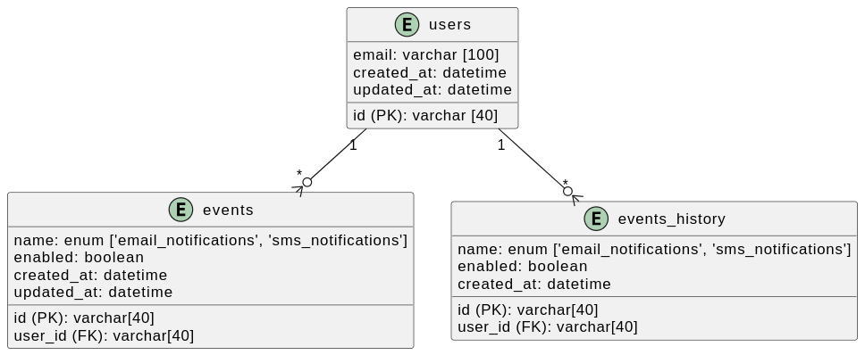
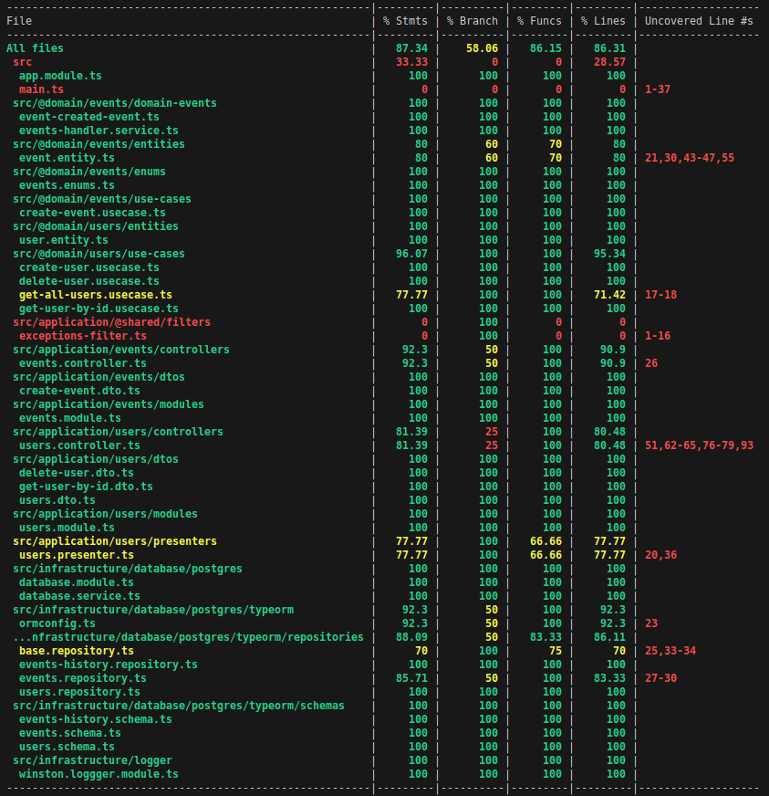

# API-RESTful

Api RESTful desenvolvida para o cadastro de produtores rurais e suas fazendas como teste técnico para desenvolvedor back end na VERX.

## Principais elementos utilizados no desenvolvimento

- node v20.9.0
- express
- typescript
- postgres
- typeORM
- jest
- supertest
- eslint
- swagger
- docker
- docker compose
- kubernetes

## Principais design patterns adotados

- Clean Code
- Single Responsability Principle (SRP)
- Don't repeat yourself (DRY)
- Keep it simple, stupid (KISS),
- You aren't gonna need it (YAGNY)
- Repository
- Dependency Injection
- Dependency Inversion
- Interface Segregation

## Arquitetura

Toda a construção da api assim como a hierarquia de pastas foram definidos aplicando práticas de modelagem do Domain Driven Design (DDD) em conjunto com Clean Architecture. Dessa forma, a arquitetura proteje as regras de negócio, com as entidades referentes ao dominio principal da aplicação no nucleo, matendo as partes agregadas ao negócio nas extremidades da arquitetura, como sugerem as arquiteturas limpa e hexagonal.

Como parte das práticas do DDD, destaca-se a criação das entidades de domínio contendo suas respectivas validações oriundas das regras de negócio, assim como a construção de value objects quando se fez necessário. Além disso, toda a estrutura da hierarquia de pastas adotada mantendo uma linguagem ubiqua.

Por outro lado, destaca-se como práticas referentes a arquitetura limpa a criação de camadas anticorrupção entre os elementos de dominio e as partes agregadas da aplicação, possibilitando tanto a injeçao de dependências quanto a inversão dessas dependencias, tornando o código mais desacoplado.

Além disso, também foi utilizado arquitetura orientada a eventos em uma das features implementadas.

## Descrição

A Api elaborada possui duas entidades de domínio, Users e Events.
Como convensão para escopo do desenvolvimento do teste foi definido que um Users pode ter várias Events, contudo um Event pode pertencer apenas a um User.

Alé disso há tabela, events_history, que grava todos os eventos registrados para um usuário. Assim a tabela de events registra apenas os eventos mais recentes do usuário, mantendo apenas o status atual dos eventos para aquele usuário.

Para realizar as tarefas de CRUD destas entidades e suas respectivas regras de negócio elas foram modeladas para o Banco de dados postgres da seguinte forma:

- Tabelas:

  

Para realizar a atualização do status na tabela de events, foi utilizado o conceito de arquitetura orientada a eventos. Assim, quando um evento chega pelo controller, dentro do use case ele é gravado da tabela de events_history e em seguida é disparado um evento. Este evento é capturado e então é feita a atualização na tabela de events do status do consentimento do usuário.

O nível de maturidade adotado para elaboração da API foi o 2, já tornando-a RESTful e combinando o verbos HTTP com seus respectivos significados semânticos, assim como utilizando de forma expressiva os recursos a ações a serem executadas nas rotas da aplicação.

Todo o desenvolvimento foi guiado por testes em que foram elaborados testes automatizados de unidade para os pontos mais críticos da aplicação. Além disso, também foram desenvolvidos testes de integração para todas as rotas da aplicação, para o qual foi utilizado ou outro banco de dados exclusivo para testes.

- Cobertura de Testes da aplicação

## Detalhes de implementação

- Altíssima cobertura de testes. Para verificar basta executar o comando **npm run test:cov** após configurar o projeto localmente.
- Utilizalção de git flow e conventional commits.
- Utilização de arquitetura orientada a eventos.
- Utilização de logs estruturados em formato JSON para facilitar o scrap de ferramentas de observabilidade

### Devido ao escopo ser uma aplicação de teste não foram adotadas:

- Instrumentação de métricas, traces e logs para observabilidade
- Criaçao/Alteração das tabelas por meio de migrations. (**_Foi utilizado o atributo syncronize do TypeORM com true, o que não deve ser feito em produção_**)

## Ci-Cd

- Como prática de Devops abrangendo construções e entregas contínuas, para escopo deste teste foi criado um pipeline de ci com github actions que realiza o build do projeto, executa a ferramenta de lint para conferência de errors estáticos do código e também executa os testes unitário da aplicação.

- Por outro lado, como entrega contínua, a aplicação é implantada no serviço Cloud Run do GCP que é vinculado ao repositório do projeto e, quando ocorre uma atualização no branch main é construída uma nova versão a partir da imagem docker, descrita no Dockerfile e, essa nova versão já fica disponível em produção.

- Para proteção do deploy utilizando essa estratégia basta configurar o repositório no github para não aceitar push diretamente no branch main, sendo que isso śo poderá ocorrer via aprovação de PR e, também configurar que a PR só porderá ser aprovada após a execução do pipeline. Por questões de agilidade, e por se tratar de uma aplicação com escopo de teste, não foram aplicadas essas configurações

- Outra estratégia, que não foi adotada devido a envolver custos e escopo, é a integração do pipeline de ci com o sonarqube onde podem ser inferidas regras para barrar códigos mal escritos e com baixa porcentagem de cobertura de testes.

- Para execução da aplicação são necessários 2 bancos de dados, um para os dados da aplicação e o outro para a execução dos testes de integração. Localmente o arquivo docker compose já constrói esses dois bancos, entretando para produção apenas o banco da aplicação foi criado em um seviço do provedor Render.

- Foi elaborado também os arquivo de deployment.yaml, secrets.yaml e service.yamol para que e aplicação seja implantada em um cluster kubernetes apenas configurando as variáveis de ambiente corretamente.

- **OBS**: A escolha de hospedagem da aplicação no GCP e do banco de dados no provedor Render foi devido a ter a disponibilidade destes recursos de forma gŕatis com algumas limitações, mas sendo suficiente para testar a aplicação em um ambiente de produção e serverless. Outras estratégias poderiam ser utilizadas aqui, como construção das pipelines de Ci diretamente nos cloud providers via Code Pipeline (AWS) ou Cloud Build (GCP), combinando estratégias de contrução da imagem docker e gravação desta no artifact registry (GCP) ou ECR (AWS) e posterior implantação como serverless no Cloud Run(GCP) ou Fargate(AWS). Estas estratégias assim como outras possíveis não foram adotadas pois envolvem custos.

## Documentação OpenApi

- Foi elaborado a documentação da api em formato OpenApi que está contido em docs/api.yaml. Neste arquivo estão descritas todas as rotas da aplicação.

- Para visualizar essa documentação assim como executar as requisições, foi utilizado o swagger podendo ser configurado para executar as requisições tanto no ambiente local, quanto em produção.
